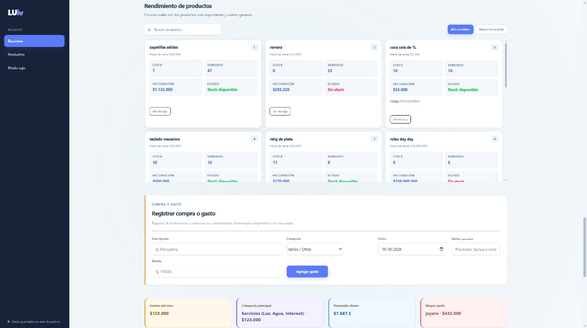
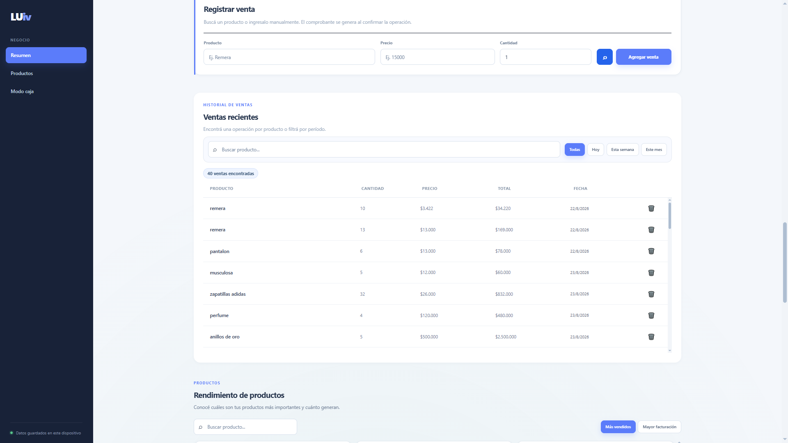
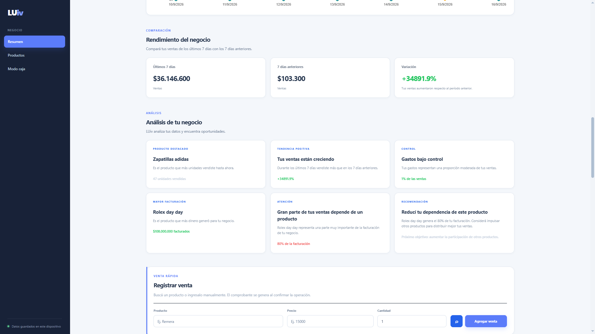
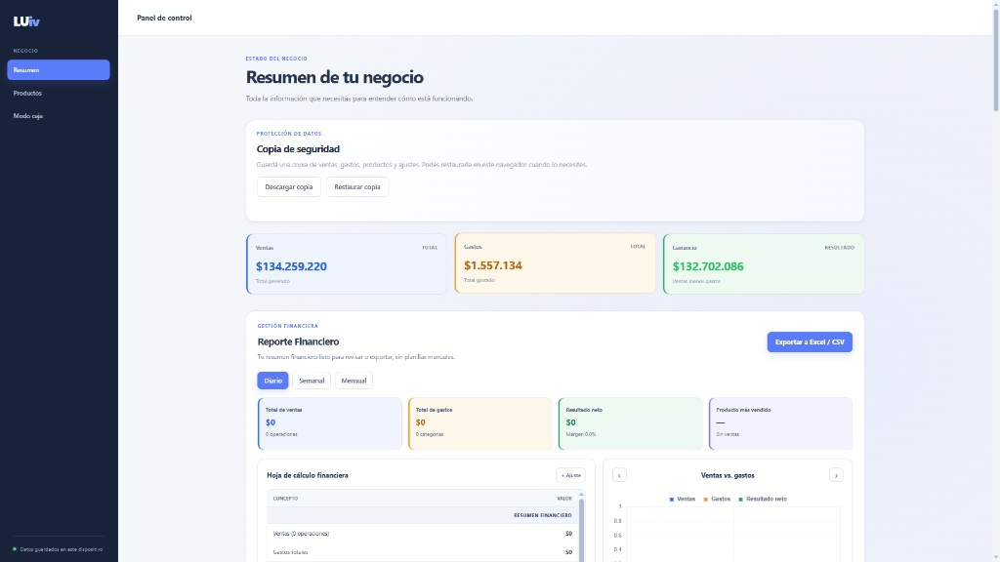
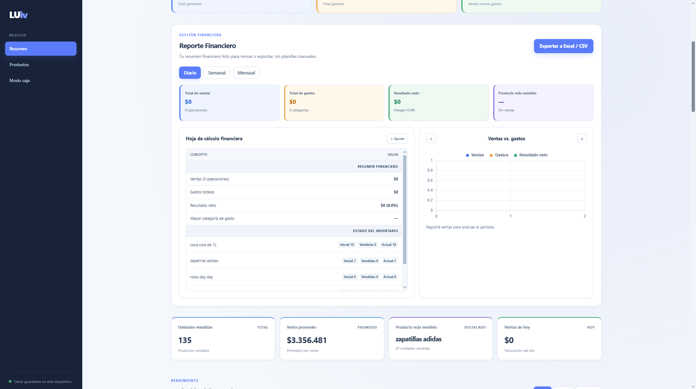

# 💼 LUiv - Business Management & Finance Dashboard


## 📌 Descripción del Proyecto
**LUiv** es una plataforma web de gestión comercial y analítica financiera diseñada para centralizar la operación de pequeños y medianos negocios. Integra un módulo transaccional para punto de venta (POS), control exhaustivo de egresos y un **panel ejecutivo de control** que transforma datos brutos en métricas clave para la toma de decisiones.

---

## 🖼️ Interfaz y Módulos del Sistema

| Resumen de Negocio y KPIs | Reporte Financiero y Gráficos |
|:-:|:-:|
|  |  |

| Análisis de Rendimiento e Insights | Registro y Historial de Ventas (POS) |
|:-:|:-:|
|  |  |

| Gestión de Inventario y Productos |
|:-:|
|  |

---

## ⚡ Funcionalidades Clave

* 🛒 **Módulo Punto de Venta (POS):** Registro ágil de operaciones, emisión de comprobantes internos e historial detallado con buscadores.
* 💸 **Gestión Financiera y Caja:** Control de egresos por categoría, monitoreo de flujo de efectivo y balance neto diario/semanal/mensual.
* 📊 **Analytics e Insights Inteligentes:** Identificación automática de tendencias de ventas, productos más rentables y alertas de concentración de facturación.
* 📦 **Control de Inventario:** Diagnóstico de stock disponible, productos agotados y métricas de rendimiento individual por artículo.
* 💾 **Protección de Datos:** Sistema integrado para descargar y restaurar copias de seguridad locales.

---

## 🛠️ Stack Tecnológico
* **Frontend:** HTML5, CSS3, JavaScript (ES6+), Chart.js
* **Backend:** Node.js / Express
* **Base de Datos:** SQLite / JSON Storage
* **Herramientas:** Visual Studio Code, Git & GitHub

---

## 🚀 Cómo Ejecutar el Proyecto Localmente

1. Clonar el repositorio:
   ```bash
   git clone [https://github.com/ivanduarttt01-stack/LUiv-finance-dashboard.git](https://github.com/ivanduarttt01-stack/LUiv-finance-dashboard.git)
   cd LUiv-finance-dashboard
